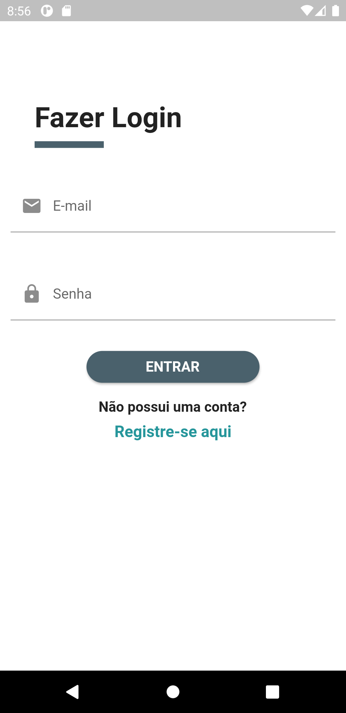
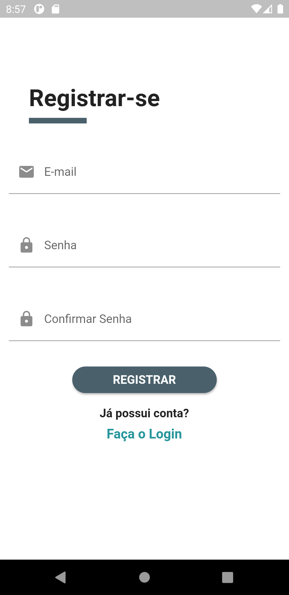
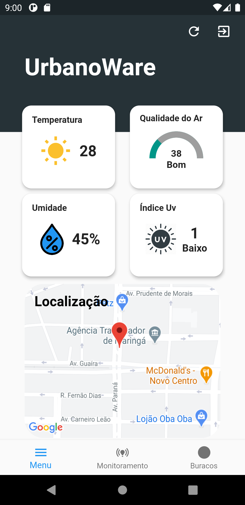
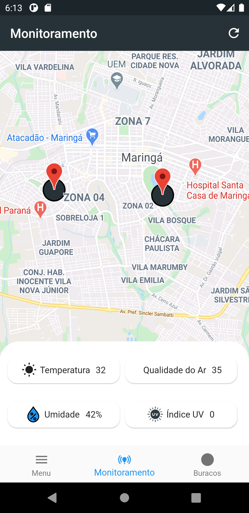
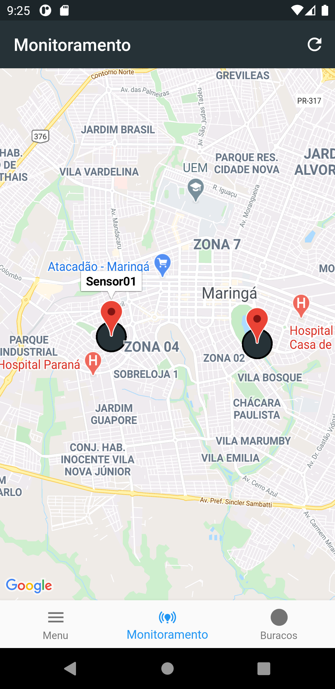
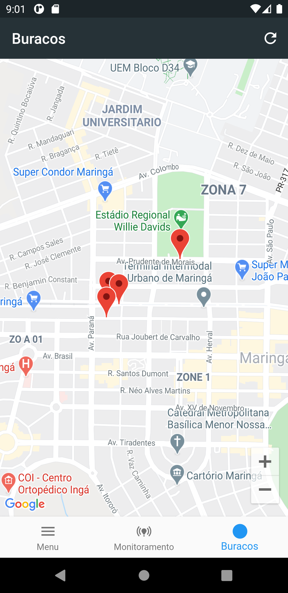

# UrbanoWare

Trabalho de Conclusão de Curso apresentado como requisito parcial para obtenção do título de Bacharel em Ciência da Computação. Neste trabalho foi implementado uma rede LoRa que realiza o monitoramento do conforto urbano, onde a população tem acesso á esses dados via um aplicativo para smartphones. 

O sistema é composto por dispositivos de borda com quatro sensores acoplados, responsáveis por fazer a coleta dos dados e envio das informações via LoRa. O gateway é responsável por receber os dados em um intervalo de tempo e enviar as informações recebidas para o banco de dados na nuvem. Por fim, um aplicativo Android exibe as informações dos dados coletados para o usuário em tempo real.

O sistema de hardware se encontra em https://github.com/andrella30/UrbanoWareHardwareSetup

# UrbanoWareCity App
- Gerência de Estado: Mobx
- Gerência de instancias utilizando a biblioteca GetIt.
- Consumo de API Firebase
- Uso do Google Maps
- Autenticação por Email/Senha Firebase

Aplicativo desenvolvido para cidades inteligentes que permite os usuários obterem informações sobre índices de conforto urbano por meio de nós sensores sem fio e outros elementos de IoT espalhados pela cidade, habilitando a coleta de diversos parâmetros.

## Getting Started
O aplicativo ainda é um protótipo, mas pode ser testado seguindo o seguinte passo a passo:

### Pré-Requisitos 
Antes de começar, você vai precisar ter instalado em sua máquina as seguintes ferramentas: .[Git](https://git-scm.com/), [Flutter](https://flutter.dev/), [Android Studio](https://developer.android.com/studio), Além disso é bom ter um editor para trabalhar com o código como .[VScode](https://code.visualstudio.com/).

### Clone este repositório
$ git clone git@github.com:andrella30/AppUrbanoWare.git

### Vá para a pasta do projeto
$ cd AppUrbanoWare

### No terminal execute o seguinte comando
$ flutter pub get

### Com um emulador ou dispositivo Android conectado execute o seguinte comando
$ flutter run

### Na tela de login utilizar o seguinte email e senha
email: user@user.com
senha: 102030.

### 🛠 Ferramentas

As seguintes ferramentas foram usadas na construção do projeto:

- [Flutter](https://flutter.dev/)
- [Android Studio](https://developer.android.com/studio),
- [Firebase](https://firebase.google.com/?hl=pt-br), 
- [VScode](https://code.visualstudio.com/)

## Screenshots

### Autenticação

 
 

### Tela Inicial

### Tela com localização dos sensores 

 

### Tela de buracos identificados

